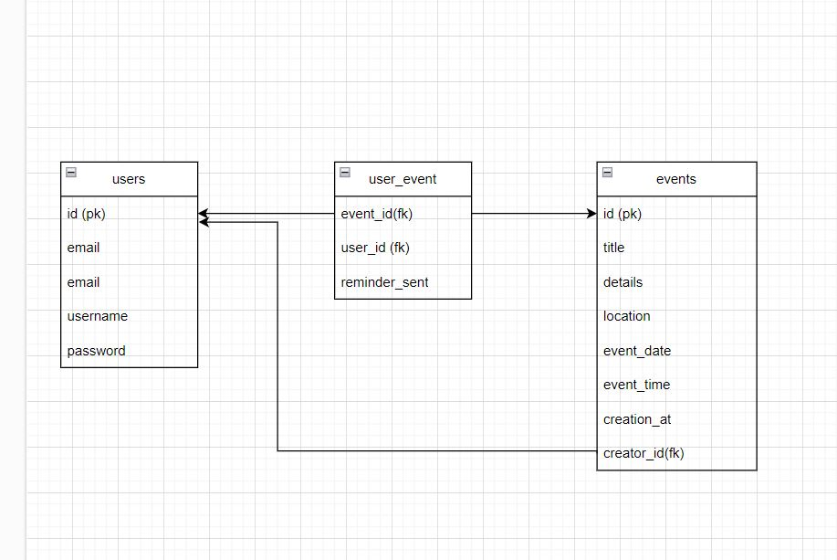

# EventPlannerAPI

This EventPlannerAPI application provides backend functionality for managing events and user registrations. It offers a range of endpoints for creating, updating, and deleting events, as well as for registering and unregistering users for events, user authentication, and more.


## DataBase Architecture



## Components:

1. **Main Application (`app/main.py`):**
   - Entry point of the application.
   - Sets up FastAPI application, routes, authentication, and background tasks.
   - Implements health check endpoint, token generation endpoint, logging setup, and more.

2. **Authentication (`app/auth/auth.py`):**
   - Handles user authentication and access token generation.
   - Provides functions for verifying passwords, creating access tokens, and retrieving the current user.

3. **Database Operations (`app/database/operations`):**
   - Contains modules for database operations related to events and users.
   - Implements functions for creating, updating, and deleting events, registering and unregistering users for events, and user registration.

4. **Database Models (`app/models`):**
   - Defines SQLAlchemy models for events, users, and the many-to-many relationship between users and events.
   - Contains classes representing Event, User, and UserEvent models.

5. **Schemas (`app/schemas`):**
   - Defines Pydantic models for request and response data validation.
   - Contains classes representing schemas for events, users, and user authentication.

6. **Routes (`app/routes`):**
   - Contains route handlers for various endpoints.
   - Implements endpoints for user registration, login, event management, user registration for events, and more.

7. **Background Tasks (`app/tasks/background_tasks.py`):**
   - Implements background tasks for sending reminders for upcoming events.
   - Sends reminders to event attendees within 30 minutes of the event start time.

8. **Utility Modules (`app/utils`):**
   - Contains utility modules for "email" sending, logging setup, and other helper functions.

## Local Deployment Instructions

### 1. Install Python
Ensure you have Python 3.10 installed on your local machine. You can download and install Python from the [official website](https://www.python.org/downloads/).

### 2. Clone the Repository
Clone the repository to your local machine using Git. Open a terminal or command prompt and run the following command:
   ```bash
   git clone https://github.com/Nivrin/EventPlannerAPI.git
   ```
### 3. Navigate to the Project Directory
Change your current directory to the project directory:
   ```bash
   cd EventPlannerAPI
   ```
### 4. Install Dependencies
Install the required Python dependencies using pip and the requirements.txt file:
   ```bash
   pip install -r requirements.txt
   ```
### Run the Application
Once the dependencies are installed, you can run the application using Uvicorn:
   ```bash
   uvicorn app.main:app --host 127.0.0.1 --port 8000 --reload
   ```

## Access the API:
You can now access the API endpoints by navigating to the following URL in your browser:

To access the interactive API documentation provided by Swagger UI, navigate to the following URL in your browser:

- [API Documentation](http://localhost:8000/docs)

This will open a web interface where you can explore and interact with the available endpoints.

Additionally, you can access the logs endpoint to view the application logs. Navigate to the following URL in your browser:

- [Logs Endpoint](http://localhost:8000/logs)

## Local Deployment Instructions - By Docker

### 1. Clone the repository:
Clone the repository to your local machine using Git. Open a terminal or command prompt and run the following command:
   ```bash
   git clone https://github.com/Nivrin/EventPlannerAPI.git
   ```

### 2. Navigate to the project directory:
Change your current directory to the project directory:

   ```bash
   cd EventPlannerAPI
   ```
### 3. build the Docker image
After navigating to the project directory, build the Docker image using the following command:
   ```bash
    docker build -t EventPlannerAPI .  
   ```
### 4. Run the Docker container 
Once the Docker image is built, you can run a Docker container using the following command:
   ```bash
   docker run -p 8000:8000 EventPlannerAPI
   ```

## Access the API:
You can now access the API endpoints by navigating to the following URL in your browser:

To access the interactive API documentation provided by Swagger UI, navigate to the following URL in your browser:

- [API Documentation](http://localhost:8000/docs)

This will open a web interface where you can explore and interact with the available endpoints.

Additionally, you can access the logs endpoint to view the application logs. Navigate to the following URL in your browser:

- [Logs Endpoint](http://localhost:8000/logs)

## Endpoints:

### **Base URL**: `/users`

### 1. User Registration:

- **Endpoint:** `/users/register`
- **Method:** POST
- **Description:** Registers a new user with the provided email and username.
- **Request Body:** JSON object containing `email` and `username`.
- **Response:** JSON object containing user details if registration is successful.

### 2. User Login:

- **Endpoint:** `/users/login/`
- **Method:** POST
- **Description:** Logs in an existing user with the provided username and password.
- **Request Body:** JSON object containing `username` and `password`.
- **Response:** JSON object containing an access token if login is successful.


## Events API

**Base URL**: `/events`

---

### 1. Create Event

- **Route**: `POST /CreateEvent/`
- **Description**: Create a new event.
- **Request Body**: `EventCreate` schema
- **Response**: `EventResponse` schema
- **Authorization**: Requires authentication token in headers

---

### 2. Get Events

- **Route**: `GET /GetEvents/`
- **Description**: Retrieve all events optionally filtered by location, sorted by various parameters, or filtered by event ID.
- **Query Parameters**:
  - `location`: Filter events by location/venue.
  - `sort_by`: Sort events by date, popularity, or creation time.
  - `event_id`: Filter event by ID.
- **Response**: List of `EventResponse` schemas
- **Authorization**: Requires authentication token in headers

---

### 3. Update Event

- **Route**: `PUT /UpdateById/{event_id}`
- **Description**: Update an existing event by ID.
- **Path Parameter**: `event_id`: ID of the event to be updated.
- **Request Body**: `EventUpdate` schema
- **Response**: `EventResponse` schema
- **Authorization**: Requires authentication token in headers

---

### 4. Delete Event

- **Route**: `DELETE /DeleteByID/{event_id}`
- **Description**: Delete an existing event by ID.
- **Path Parameter**: `event_id`: ID of the event to be deleted.
- **Response**: `EventResponse` schema
- **Authorization**: Requires authentication token in headers

---

### 5. Register for Event

- **Route**: `POST /RegisterEvent/{event_id}`
- **Description**: Register the current user for a specific event.
- **Path Parameter**: `event_id`: ID of the event to register for.
- **Response**: `EventResponse` schema
- **Authorization**: Requires authentication token in headers

---

### 6. Unregister from Event

- **Route**: `POST /UnregisterEvent/{event_id}`
- **Description**: Unregister from a specific event.
- **Path Parameter**: `event_id`: ID of the event to unregister from.
- **Response**: `EventResponse` schema
- **Authorization**: Requires authentication token in headers